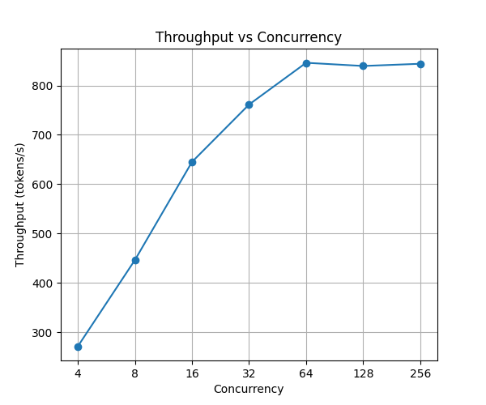
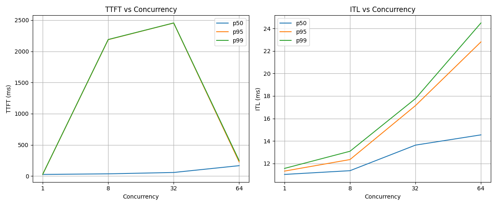

# Skeleton

1. **Intro** — what this post does: set up a real benchmark, measure the concurrency-throughput-latency tradeoff, establish the baseline that future optimization posts will be measured against
2. **Setup** — hardware, model, vLLM version; one paragraph, no config blocks, link GitHub
3. **Benchmark methodology** — closed-loop semaphore and why, how TTFT/ITL are measured from the stream, why 4096 requests
4. **Results: throughput** — saturation curve, GPU hits max around c=64
5. **Results: latency** — TTFT and ITL cost of high concurrency, the p50/p95 convergence at c=256
6. **The tradeoff** — throughput plateaus but latency keeps degrading; the right concurrency depends on your SLO
7. **[Future] Chunked prefill comparison** — use the same benchmark to show chunked prefill on vs off; connects blog 3 theory to real measurements; expected story: ITL is spikier without chunked prefill as large prefills monopolize the GPU
8. **What's next** — this baseline is the reference point for prefix caching, quantization, and speculative decoding

---

# Baseline Setup and First Measurements

The first three posts covered the theory: autoregressive generation, the KV cache, PagedAttention, continuous batching, and the scheduler. Now it's time to measure. Before benchmarking any optimization, we need a baseline — a controlled measurement of how vLLM behaves under increasing load, with no features enabled beyond the defaults. This post sets that up.

---

## Setup

All experiments run on a single H100 80GB on RunPod, serving Llama 3.1 8B Instruct with vLLM 0.19.0. The model runs on a single GPU in FP16, with prefix caching disabled so that shared patterns in the workload don't inflate results. The full server config and benchmark code are in the [inference-lab repo](https://github.com/arulster17/inference-lab).

---

## Benchmark methodology

### Workload

Each request consists of a 512-token synthetic prompt and a 256-token maximum output. Prompts are randomly generated with a unique sequence per request. Fixed lengths let us isolate concurrency as the only variable — if prompt lengths varied, differences in results could come from the mix of long and short prompts landing in each batch rather than from concurrency itself.

### Traffic simulation

We use a *closed-loop* benchmark: we send a fixed pool of requests and cap how many can be in flight at once. When one request finishes, the next starts immediately, always keeping exactly N requests active. This is not how real traffic arrives — in production, requests come in at some rate regardless of what the server is doing. But for mapping the throughput-latency curve, closed-loop is the right tool. It gives direct control over server load and produces clean, reproducible results at each concurrency level.

We sweep concurrency across 9 levels: 1, 2, 4, 8, 16, 32, 64, 128, and 256.

### Metrics

Three metrics are tracked per run:

- **TTFT (time to first token)**: time from when the HTTP request is sent to when the first output token arrives. The clock starts after the request is actually dispatched to the server, not from when it entered a client-side queue. At low concurrency this reflects prefill time; at high concurrency it also captures how long a request waits in the scheduler queue before prefill even begins.

- **ITL (inter-token latency)**: time between consecutive output tokens in the stream. At high concurrency, more requests share each decode step, so each step takes longer.

- **Throughput**: total output tokens divided by total wall clock time, in tokens per second.

We report p50, p95, and p99 for the latency metrics. p99 with too few samples is just the single worst request — to get stable percentiles we run 4096 requests per concurrency level.

---

## Results

### Throughput

Throughput rises steeply from c=1 to c=64, then flattens completely. At c=1 the server generates around 90 tokens per second — a single request's decode steps don't produce enough work to keep the GPU's thousands of CUDA cores busy. As concurrency increases, the scheduler batches more requests into each forward pass and GPU utilization climbs. By c=64, throughput has saturated at around 1820 tokens per second. Running at c=128 or c=256 adds essentially nothing.

This is the core payoff of batching: a single H100 serving one request at a time is roughly 20x less efficient than the same hardware serving 64 concurrent requests.

### Latency

The throughput gain comes at a cost.

**TTFT** stays flat through c=32 — the scheduler handles the load without requests waiting long for prefill. At c=64 it starts climbing, and by c=256 the median request waits over 13 seconds for its first token. At that point, the p50 and p95 lines converge: when the system is severely overloaded, even average requests are stuck in a long queue. Tail latency and median latency tell the same story.

**ITL** grows more smoothly. Each decode step is shared across all active requests, so each step takes proportionally longer as concurrency rises. At c=1, median ITL is around 11ms. At c=64 it is around 14ms — still acceptable. At c=256 it reaches 43ms, meaning a 256-token response takes over 11 seconds to stream out after the first token arrives.

---

## The tradeoff

Throughput is maximized around c=64, but running there means p99 TTFT is already above 600ms. Push to c=128 or c=256 and throughput barely moves while latency becomes unusable for interactive applications.

The right operating point depends on your latency requirements. A batch processing pipeline with no latency SLO should run at high concurrency to maximize throughput. An interactive chat application targeting a TTFT p95 under 500ms needs to stay around c=32 or below — leaving throughput on the table in exchange for responsiveness.

---

## What's next

This baseline is the reference point for the rest of the series. Every optimization — prefix caching, quantization, speculative decoding — will be measured against these numbers on the same hardware and workload, so we can isolate exactly what each feature buys.

Next up: prefix caching, where vLLM reuses KV cache entries across requests that share a common prefix, dramatically cutting TTFT for workloads with repeated system prompts or few-shot examples.
