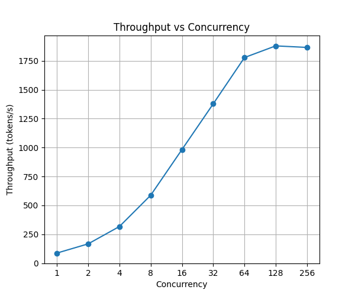
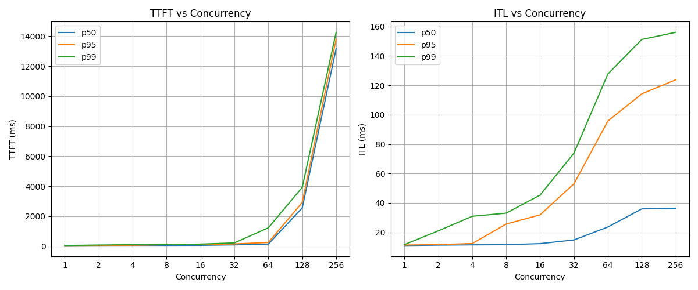
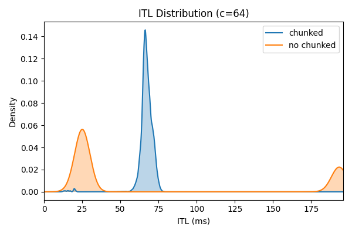

# Skeleton

1. **Intro** — we have the theory; now we need a rigorous benchmark to measure; this post builds the harness and takes first measurements, then uses the same harness to probe chunked prefill
2. **Setup** — hardware, model, vLLM version; link GitHub
3. **Benchmark methodology** — closed-loop, synthetic workload, why 4096 requests, metrics
4. **Baseline results** — throughput saturation, TTFT/ITL tradeoff, the operating point question
5. **The harness in action: chunked prefill** — blog 3 predicted chunked prefill affects ITL distribution; p50/p99 miss the real story; ITL distribution shows bimodal vs unimodal; throughput cost; the tradeoff
6. **What's next** — harness is the foundation; prefix caching next

---

# Baseline Setup and First Measurements

The first three posts covered the theory: autoregressive generation, the KV cache, PagedAttention, continuous batching, and the scheduler. Now it's time to measure. Before optimizing anything, we need a rigorous way to measure it — a benchmark harness that controls the variables, collects the right metrics, and produces reproducible results. This post builds that harness, takes the first baseline measurements, and then uses it to test one of the predictions from last post: that chunked prefill changes the shape of inter-token latency.

---

## Setup

All experiments run on a single A100 80GB SXM on RunPod, serving Llama 3.1 8B Instruct with vLLM 0.19.0. The model runs on a single GPU in FP16, with prefix caching disabled so that shared patterns in the workload don't inflate results. The full server config and benchmark code are in the [inference-lab repo](https://github.com/arulster17/inference-lab).

---

## Benchmark methodology

### Workload

Each request consists of a 512-token synthetic prompt and a 256-token maximum output. Prompts are randomly generated with a unique sequence per request. Fixed lengths let us isolate concurrency as the only variable — if prompt lengths varied, differences in results could come from the mix of long and short prompts landing in each batch rather than from concurrency itself.

### Traffic simulation

We use a *closed-loop* benchmark: we send a fixed pool of requests and cap how many can be in flight at once. When one request finishes, the next starts immediately, always keeping exactly N requests active. This is not how real traffic arrives — in production, requests come in at some rate regardless of what the server is doing. But for mapping the throughput-latency curve, closed-loop is the right tool. It gives direct control over server load and produces clean, reproducible results at each concurrency level.

We sweep concurrency across 9 levels: 1, 2, 4, 8, 16, 32, 64, 128, and 256.

### Metrics

Three metrics are tracked per run:

- **TTFT (time to first token)**: time from when the HTTP request is sent to when the first output token arrives. The clock starts after the request is actually dispatched to the server, not from when it entered a client-side queue. At low concurrency this reflects prefill time; at high concurrency it also captures how long a request waits in the scheduler queue before prefill even begins.

- **ITL (inter-token latency)**: time between consecutive output tokens in the stream. At high concurrency, more requests share each decode step, so each step takes longer.

- **Throughput**: total output tokens divided by total wall clock time, in tokens per second.

We report p50, p95, and p99 for the latency metrics. p99 with too few samples is just the single worst request — to get stable percentiles we run 4096 requests per concurrency level.

---

## Results

### Throughput

Throughput rises steeply from c=1 to around c=128, then flattens. At c=1 the server generates around 90 tokens per second — a single request's decode steps don't produce enough work to keep the GPU's thousands of CUDA cores busy. As concurrency increases, the scheduler batches more requests into each forward pass and GPU utilization climbs. By c=128, throughput has saturated at around 1880 tokens per second. Running at c=256 adds essentially nothing further.

This is the core payoff of batching: a single A100 serving one request at a time is roughly 20x less efficient than the same hardware serving 128 concurrent requests.

### Latency

The throughput gain comes at a cost.

**TTFT** stays relatively flat through c=64 for the median — at c=32, p50 TTFT is under 100ms; at c=64, it's still only 150ms. But tail latency is already a warning sign: p99 TTFT at c=64 has crossed 1.2 seconds. At c=128 the cliff arrives: median TTFT jumps to 2.5 seconds. By c=256 the median request waits over 13 seconds for its first token, and the p50 and p95 lines converge — when the system is severely overloaded, even average requests are stuck in a long queue.

**ITL** grows more smoothly. Each decode step is shared across all active requests, so each step takes proportionally longer as concurrency rises. At c=1, median ITL is around 11ms. At c=64 it is around 24ms — still acceptable. At c=256 it reaches 36ms, meaning a 256-token response takes around 9 seconds to stream out after the first token arrives.

---

## The tradeoff

Throughput is maximized around c=128, but running there means median TTFT has already reached 2.5 seconds — unusable for interactive applications. At c=256, throughput barely moves while latency worsens further.

The right operating point depends on your latency requirements. A batch processing pipeline with no latency SLO should run at high concurrency to maximize throughput. An interactive chat application can run at c=64 and still capture around 95% of peak throughput, with p95 TTFT at 255ms — a natural sweet spot at the knee of the curve. Applications with stricter p99 requirements need to drop to c=32 or below.

---

## The harness in action: chunked prefill

The last post explained how chunked prefill works: instead of processing a large prompt in one monolithic step, vLLM splits it into fixed-size chunks and interleaves those chunks with decode work. The prediction was that this would smooth out ITL — no more single large prefills monopolizing a decode step and causing latency spikes for every other in-flight request.

Let's measure it.

We rerun the sweep with 2048-token prompts and compare two configs: chunked prefill enabled with `max-num-batched-tokens=512` (vLLM's default behavior), and chunked prefill explicitly disabled. Longer prompts make the effect more pronounced — at 512 tokens the difference is too small to see clearly. Everything else stays identical.

### What the percentiles say

At c=64, the summary stats look like this:

|  | Chunked | No chunked |
|---|---|---|
| ITL p50 | 67ms | 25ms |
| ITL p99 | 75ms | 196ms |
| Throughput | 701 tps | 833 tps |

The p99 result matches the prediction — chunked prefill cuts tail ITL from 196ms to 75ms. But the p50 result is surprising: chunked prefill is actually *slower* at the median, 67ms vs 25ms. How can something improve tail latency while making typical latency worse?

### What the distribution actually looks like

The percentiles are hiding the real story. Here is the ITL distribution at c=64:

Without chunked prefill the distribution is *bimodal*: most decode steps are fast pure-decode steps clustered around 25ms, but when a 2048-token prefill lands it monopolizes that entire step, spiking every in-flight request's ITL to around 195ms. The p50 is low because most steps are the fast kind. The p99 is high because of the spike.

With chunked prefill the distribution collapses to a single peak at 67ms. There are no spikes — prefill work is spread across many steps so no single step is dramatically slower than the others. But every decode step now carries some prefill work, so the typical step is slower than the typical pure-decode step without chunking.

Chunked prefill trades *bimodal* latency (fast steps + rare spikes) for *uniform* latency (every step is medium). Whether that's better depends entirely on what you care about. For smooth streaming, chunked prefill wins. For raw p50 ITL, it's worse.

### The throughput cost

There's also a throughput penalty. With `max-num-batched-tokens=512`, each forward pass is capped at 512 tokens. Without that cap, vLLM batches more aggressively and sustains around 830 tps at saturation. With the cap, saturation throughput drops to around 700 tps — about 16% less.

This is the full tradeoff: chunked prefill costs 16% throughput and raises median ITL in exchange for eliminating tail ITL spikes. For a system where streaming smoothness matters, that's a good trade. For a batch pipeline, it isn't.

---

## What's next

The harness is built and the baseline is measured. Every optimization in the rest of the series — prefix caching, quantization, speculative decoding — will be measured against these numbers on the same hardware and workload, so we can isolate exactly what each feature buys.

Next up: prefix caching, where vLLM reuses KV cache entries across requests that share a common prefix, dramatically cutting TTFT for workloads with repeated system prompts or few-shot examples.
