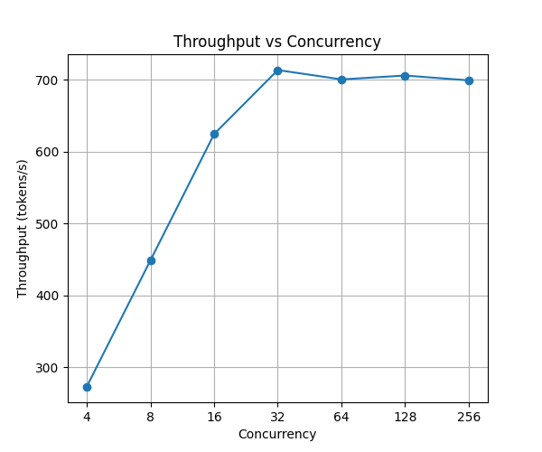
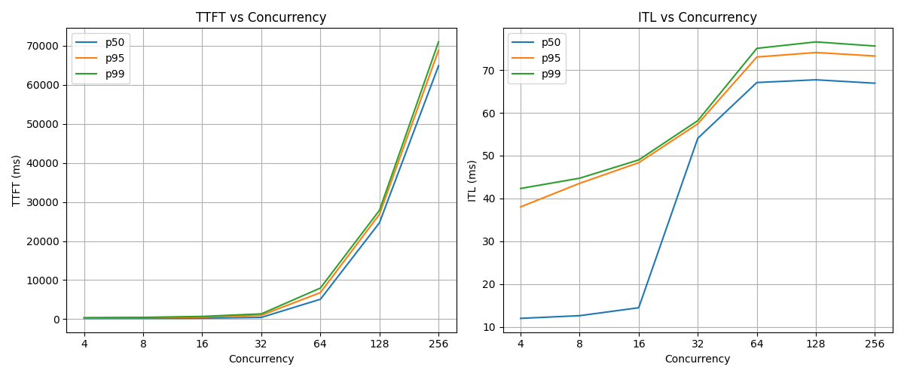

# Skeleton

1. **Intro** — theory is done; now we need to measure; this post builds the benchmark harness, takes first baseline measurements, then uses the harness to probe chunked prefill
2. **Setup** — hardware, model, vLLM version; link GitHub
3. **Benchmark methodology** — closed-loop, synthetic workload, why 4096 requests, metrics
4. **Baseline results** — throughput saturation, TTFT/ITL tradeoff, the operating point question
5. **The harness in action: chunked prefill** — switch to 2048-token prompts; ITL distribution shows bimodal vs unimodal; TTFT cost; the tradeoff
6. **What's next** — harness is the foundation; prefix caching next

---
    
# Baseline Setup and First Measurements

Optimization without measurement is just guessing. Before we can say that prefix caching cuts TTFT by 40% or that quantization costs 5% throughput, we need a controlled way to measure it: a benchmark harness that holds the right variables fixed, collects the right metrics, and produces results we can reproduce and compare across configurations. This post builds that harness, takes the first baseline measurements, and then uses it to test one of the predictions from the last post: that chunked prefill changes the shape of inter-token latency.

---

## Setup

All experiments run on a single A100 80GB SXM on RunPod, serving Llama 3.1 8B Instruct with vLLM 0.19.0. The model runs in FP16 with prefix caching disabled. The full server config and benchmark code are in the [inference-lab repo](https://github.com/arulster17/inference-lab).

---

## Benchmark methodology

We use a *closed-loop* benchmark: a fixed pool of requests with a cap on how many can be in flight at once. In production, requests arrive at some rate regardless of what the server is doing. Closed-loop ignores that arrival process and directly controls server load, which makes it the right tool for mapping the throughput-latency curve. Each request uses a 512-token prompt and 256-token maximum output. Fixing both lengths means concurrency is the only variable we are changing.

We sweep across 9 concurrency levels: 1, 2, 4, 8, 16, 32, 64, 128, and 256.

Three metrics are tracked per run:

- **TTFT (time to first token)**: how long until the first output token arrives. At low concurrency this is mostly prefill time; at high concurrency it also includes time spent waiting in the scheduler queue.
- **ITL (inter-token latency)**: time between consecutive output tokens.
- **Throughput**: total output tokens per second across all requests.

We report the 50th, 95th, and 99th percentiles rather than the mean, which is skewed by outliers and obscures the typical experience. The 50th percentile tells us what a typical request sees; the 95th and 99th tell us about the tail, which matters because even a small fraction of requests with very high latency translates to a bad user experience in practice. The gap between the 50th and 99th percentile is also informative on its own: a wide gap means the system is inconsistent, even if the median looks fine. We run 4096 requests per level to keep the tail percentiles stable.

---

## Results

### Throughput

Throughput rises steeply from c=1 to around c=128, then flattens. At c=1, the server generates around 90 tokens per second. A single request's decode steps do not produce enough arithmetic work to keep the GPU's thousands of CUDA cores busy, so most of the hardware sits idle. As concurrency increases, the scheduler batches more requests into each forward pass, GPU utilization climbs, and throughput rises accordingly. By c=128, throughput has saturated at around 1880 tokens per second. Once every forward pass is already using the GPU's compute and memory bandwidth to their limits, adding more requests to the batch cannot increase the rate at which tokens are produced. Running at c=256 adds essentially nothing further.

This is the core payoff of batching: the same A100 serving one request at a time is roughly 20x less efficient than when serving 128 concurrent requests.

### Latency

TTFT and ITL respond to concurrency in very different ways.

**TTFT** stays nearly flat through c=64, then cliffs. At c=1 the median is around 20ms; by c=64 it has only crept up to 150ms. Between c=64 and c=128 it jumps to 2.5 seconds, and at c=256 the p50, p95, and p99 lines have converged above 13 seconds — even typical requests wait that long for their first token.

The shape comes from a phase change at saturation:

- **Below saturation (c ≤ ~64).** A new request joins the next forward pass immediately; there is no real queue. TTFT is roughly the duration of one forward pass. That duration barely grows with batch size when the GPU has slack — at small batches the pass is overhead-dominated, not compute- or bandwidth-bound. Adding sequences to the batch is nearly free until the GPU is actually saturated, so TTFT only creeps up.

- **Past saturation (c ≥ ~128).** Throughput has plateaued, which means the GPU physically cannot serve all in-flight requests per step. The scheduler admits new requests only as fast as old ones finish, and the rest sit in vLLM's internal `waiting` list. TTFT is now dominated by that queue wait. Roughly, if `M` is how many requests the GPU can actively decode in parallel and the completion rate is throughput divided by output tokens (≈ 7 reqs/sec here), then each new request enters the back of the queue and waits for `(C − M)` requests to finish before being admitted. Wait time becomes nearly deterministic: every request faces the same queue depth. At c=128 that depth is small (~8), and per-completion variance still affects each request's wait noticeably, so the percentiles stay spread out. At c=256 the depth is ~224 — large enough that variance in any single completion averages out across many events, so every request waits roughly the same amount and the p50, p95, and p99 lines collapse onto each other.

So the TTFT cliff isn't caused by per-step duration suddenly exploding. It's caused by crossing the saturation point and entering a regime where requests pile up in an internal queue that grows with how far past saturation the system is pushed.

**ITL** grows more smoothly. Each decode step is shared across all active requests, so the cost is spread equally. Median ITL roughly doubles from 11ms at c=1 to 24ms at c=64, and reaches 36ms at c=256.

### The operating point

Throughput saturates around c=128, but running there means median TTFT has already reached 2.5 seconds. At c=256, throughput barely moves while latency worsens further. Around c=64, throughput is at roughly 95% of its peak and p95 TTFT is still under 300ms. The curve bends here, and further increases in concurrency cost far more in latency than they return in throughput. The right operating point depends on the latency requirements of the workload.

---

## The harness in action: chunked prefill

The last post explained how chunked prefill works: instead of processing a large prompt in one monolithic prefill step, vLLM splits it into fixed-size chunks and interleaves them with decode work. The prediction was that this would smooth out ITL, since large prefills would no longer monopolize a decode step and spike the latency of every in-flight request.

We rerun the sweep with 2048-token prompts and compare chunked prefill on versus off. We use longer prompts because the effect only becomes visible when the prefill step is large relative to a decode step. At 512 tokens, a prefill completes quickly enough that it barely disturbs the decode cadence. At 2048 tokens, a single unchunked prefill dominates an entire forward pass and the disruption shows clearly in the latency distribution. We look at c=64, which sits at the knee of the throughput curve and represents a realistic operating point for a loaded server.

Without chunked prefill, the distribution is *bimodal*: most decode steps are fast pure-decode steps clustered around 25ms, but when a 2048-token prefill arrives it monopolizes that entire step, spiking every in-flight request's ITL to around 195ms. The p50 is low because most steps are the fast kind, and the p99 is high because of the occasional spike. Aggregate percentiles miss the story entirely, since the distribution has two modes and no requests actually experience the middle.

With chunked prefill, the distribution collapses to a single peak around 65ms. Prefill work is spread across many steps, so no single step is dramatically slower than the others.

The cost is TTFT. With `max_num_batched_tokens=512`, a 2048-token prompt is split into ~5 chunks, and each chunk competes with decode for that 512-token budget. Decode-first scheduling means a chunk only gets the budget decoders leave behind — at c=64 with 64 decoders, that's ~448 tokens per step for prefill. A single prefill takes roughly 5 steps to finish, and many requests are competing for those slots.

At c=64, median TTFT is around 5 seconds versus around 0.4 seconds without chunked prefill. That's the honest demonstration cost of the tradeoff: what you pay in TTFT to get the bimodal ITL distribution to collapse into a single peak.

The numbers further up the concurrency sweep look catastrophic — 28 seconds at c=128, 65 seconds at c=256 — but those say less about chunked prefill than about saturation. Two effects compound:

- `max_num_batched_tokens=512` caps total work per step at 1/4 of the baseline budget.
- 2048-token prompts mean ~4× more prefill work per request than the 512-token baseline.

Together, these push the throughput plateau from 1880 tok/s at c=128 in the baseline down to ~700 tok/s at c=32 in this run:

So at c=256, the system is 8× past saturation, and the queue dynamics from the latency section kick in much harder. With ~32 active decode slots and a completion rate of ~2.7 reqs/sec, the simple model predicts a queue wait of `(256 − 32) / 2.7 ≈ 83` seconds — close to the observed 65 seconds. The full TTFT sweep shows the same saturation cliff as the baseline, just shifted left to c=32.

Two framing notes:

1. The c=64 figure (~5s TTFT) is the right number for understanding the chunked-prefill tradeoff. The c=128 and c=256 figures mix in the cost of running deep into the queue regime and overstate what chunked prefill itself costs.
2. The tight `max_num_batched_tokens=512` here is chosen to make the ITL effect clearly visible. A more realistic value (2048 or 4096) would let prefill complete in 1–2 chunks per request, and the TTFT penalty would be much smaller. Production deployments tune this knob to balance the two metrics for their workload.

Closed-loop benchmarking also holds the queue permanently full. In real bursty traffic, request arrival has quieter periods that let pending prefills catch up, and the TTFT penalty shrinks further.

---

## What's next

The harness is built and the baseline is measured. Every optimization in the rest of the series will be measured against these numbers on the same hardware and workload, so we can isolate exactly what each feature buys.

Next up: prefix caching, where vLLM reuses KV cache entries across requests that share a common prefix, dramatically cutting TTFT for workloads with repeated system prompts or few-shot examples.
